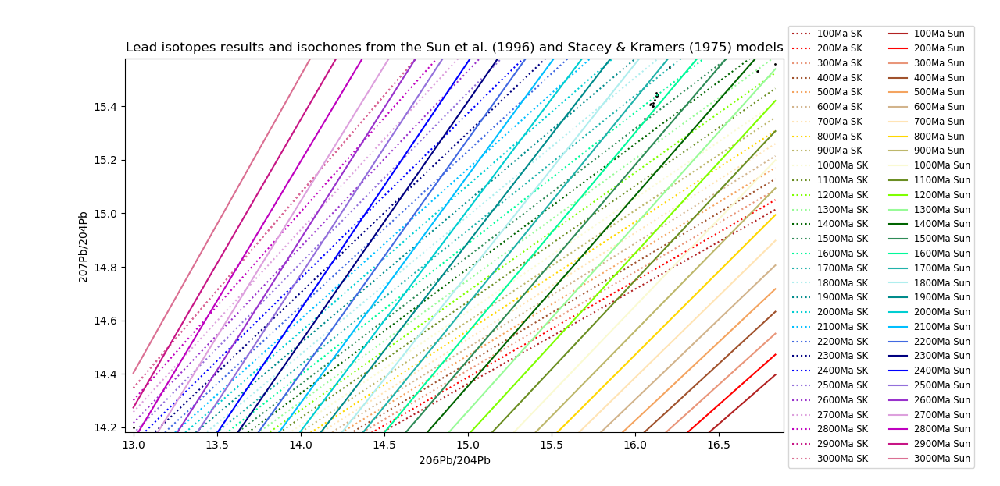

# Summary

Metals are present in our everyday life and geologists try to identify their provenance. Some minerals contain clues of their history, such as galena, a lead sulphide (PbS). Lead isotopes in lead-rich minerals are one of the tools to determine the number of metal source(s) and their model age(s). `FindAge` is an iterative Python code that can calculate rapidly different model ages thanks to lead isotope ratios, based on the equations for different lead evolution models. In addition to be compatible with the two most used global models of lead isotope evolution, it also fit to the model developed for the Northern part of Australia. This program is user-friendly thanks to an interface, and can be easily modified by the user for other models that could better suit the studied area. It has already been used in a scientific publication [@Gigon:2020].

# Introduction

Lead isotopes are wildly studied on sulphides (galena, pyrite, pyrrhotite, sphalerite, chalcopyrite, magnetite, hematite, arsenopyrite…) and whole rock to get information about their model age. For some minerals, this method is the only way to estimate their age. One of the most used method for model age estimations is the one of @Stacey:1975, and another one was developed by @Cumming:1975. However, this last model is not well appropriate for the Northern part of Australia and @Sun:1996 modified it to better fit the Australian data. This new Python program aims to quickly calculate the model ages and associated parameters thanks to the @Sun:1996 and @Stacey:1975 models as it was designed for Proterozoic samples of the North Australian Craton. However, as the @Sun:1996 model is adapted from the @Cumming:1975 one only by changing one parameter value, this algorithm can be easily used for both models. The scope of this program in to calculate large sets of data when doing synthesis at regional scale for example.

# Program

The program takes as input an Excel sheet in .csv format with three columns: Sample name, $^{206}$Pb/$^{204}$Pb and $^{207}$Pb/$^{204}$Pb ratios. The output is an Excel sheet in .csv with nine columns: Sample name, calculated age with the @Sun:1996 model in Ga, $\mu$$_{206}$=$^{238}$U/$^{204}$Pb ratio for the $^{206}$Pb decay chain in the @Sun:1996 model, $\mu$$_{207}$=$^{238}$U/$^{204}$Pb ratio for the $^{207}$Pb decay chain in the @Sun:1996 model, $\Delta$$\mu$ =$\mu$$_{206}$-$\mu$$_{207}$ in the @Sun:1996 model, and the same parameters for the @Stacey:1975 model.

## Constants and unknowns

The program works with the following constants: 

A$_{0}$ = ($^{206}$Pb/$^{204}$Pb)$_{t0}$= 9.307 [@Tatsumoto:1973]

B$_{0}$ = ($^{207}$Pb/$^{204}$Pb)$_{t0}$= 10.294 [@Tatsumoto:1973]

$\epsilon$ = 0.0833 (rate factor, [@Sun:1996])

$\lambda$$_{238}$ = 0.155125 * 10$^{-9}$ yr$^{-1}$ is the decay constant of $^{238}$U

$\lambda$$_{235}$ = 0.98485 * 10$^{-9}$ yr$^{-1}$ is the decay constant of $^{235}$U 

$\mu$$_{p}$ = 7.192 is the $^{238}$U/$^{204}$Pb ratio of the Mantle [@Tatsumoto:1973]

($^{206}$Pb/$^{204}$Pb)$_{t}$ is the measured $^{206}$Pb/$^{204}$Pb ratio

($^{207}$Pb/$^{204}$Pb)$_{t}$ is the measured $^{207}$Pb/$^{204}$Pb ratio

The 1/137.88 ratio corresponds to the $^{235}$U/$^{238}$U ratio, known to be constant for all U of normal isotopic composition in the Earth at the present time [@Halla:2018]. 

The unknowns determined by the program are: t (model age of the analysed galena or sulphide) and the $\mu$ value at that time that is found when $\mu$$_{206}$ = $\mu$$_{207}$, both parameters for the two proposed models. 

## Interface

In the interface, the user can specify several parameters that will be used in the calculation. These parameters are the emplacement of the Excelsheet containing the data, the model that will be used, and of a graphical representation will be produced or not. In addition, the $\mu$ curves for different chosen values could be added to the graphical representation.

# Lead isotopes evolution models

## Cumming and Richard (1975) and Sun et al. (1996) models 

The @Cumming:1975 model is based on the hypothesis of a steady growth in $\mu$ (representing the $^{238}$U/$^{204}$Pb ratio of a given reservoir) through time. Based on the $^{206}$Pb/$^{204}$Pb and $^{207}$Pb/$^{204}$Pb, ratios, it is possible to get the model age of crystallisation of the studied mineral by iteration. In this program, the model used is the one developed by @Sun:1996 for the North Australian Craton, which is the host of the mineralisation studied in this study. The equations in this model are the following ones: 

$\mu _{206} = (((^{206}Pb/^{204}Pb)_{t}) - A_{0}) / (e^{4.509 * \lambda _{238}} * (1 - \epsilon * (4.509 - 1/ \lambda _{238})) - e^{t * \lambda _{238}}) * (1 - \epsilon * (t - 1/ \lambda _{238})))$

and

$\mu _{207} = 137.88 * ((^{207}Pb/^{204}Pb)_{t} - B_{0}) / (e^{4.509 * \lambda _{235}} * (1 - \epsilon * (4.509 - 1/ \lambda _{235})) - e^{t * \lambda _{235}} * (1 - \epsilon * (t - 1/ \lambda _{235})))$

These systems are solved when $\Delta$$\mu$ = $\mu$$_{206}$-$\mu$$_{207}$ are close to zero, and yields t and $\mu$$_{206}$~$\mu$$_{207}$. @Cumming:1975 have chosen the rate factor $\epsilon$ = 0.050 * 10$^{-9}$ yr$^{-1}$. In the @Sun:1996 model, the $\epsilon$ value has been modified, with $\epsilon$ = 0.0833 * 10$^{-9}$ yr$^{-1}$ to better fit with the Australian data. This parameter can be modified in the program to calculate the ages with one of the two models.

## Stacey and Kramers (1975) model

The @Stacey:1975 model implies two stages in Earth’s history: in the first one, the mantle evolves until 3.7 Ga, where crust formation leads to a second stage with different parameters. The equations in this model are the following ones: 

$\mu _{206} = ((^{206}Pb/^{204}Pb)_{t} - A_{0} - \mu _{p} * (e^{ \lambda _{238} * 4.57} - e^{ \lambda _{238} * 3.7})) / (e^{ \lambda _{238} * t} - e^{ \lambda _{238} * t})$

and

$\mu _{207} = ((^{207}Pb/^{204}Pb)_{t} - B_{0} - \mu _{p} / 137.88 * (e^{ \lambda _{235} * 4.57} - e^{ \lambda _{235} * 3.7})) * 137.88 / ((e^{ \lambda _{235} * 3.7} - e^{ \lambda _{235} * t})$

These systems are solved when $\Delta$$\mu$ = $\mu$$_{206}$ - $\mu$$_{207}$ are close to zero, and yields t and $\mu$$_{206}$~$\mu$$_{207}$. 

# Graphical representation

FindAge also provides a graphical representation of the analyses (black dots) as well as the isochrones for two different models [Stacey:1975; Sun:1996]. The isochrons defined in the program are from 0 to 3000 Ma to cover the vast majority of rocks on Earth. Figure  \ref{fig:Figure1} presents the results for all the lead isotopes data acquired for the HYC deposits [@Gigon:2020].

# Acknowledgements

David Huston (Geoscience Australia) is thanked to have given the Excelsheet developed by AGSO-CSIRO actually used instead of this program, and to have supported this project since the beginning.

# References
